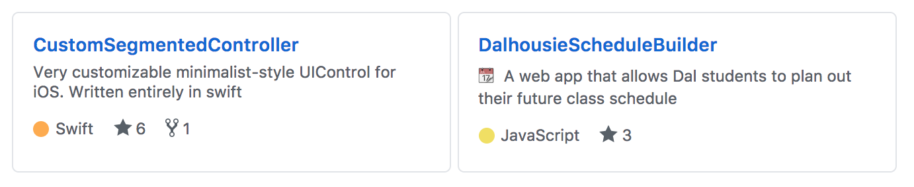

<p align="center">
  <br><br>
<a href="https://www.gnu.org/licenses/gpl-3.0">
  
</a>
  
  
</p>


# Overview 
Do you want to showcase a github repository or profile on your website? Instead of leaving a simple link, use this tool to create embedded HTML github tiles. It uses GitHub's API to grab the information, so no need to worry about updating html. You can pin profiles, single repositories, or even all repositories linked to an individual profile!

## Usage
Simply set the html **data** field with a GitHub profile, repository, or repositories tab url...
```html
<script src="d29mk5socxaj4o.cloudfront.net/GitHubPinner.js"></script>
<div data="https://github.com/mackboudreau?tab=repositories" class="github-pinner" style="visibility: hidden;"></div>
```

## Preview
<p align="left"><br>
</p>

## TODO
* Implement functionality for a "All Repos" element
* ~~Use AWS Cloudfront to serve files to reduce latency on sites~~
* Add additional option styles for tiles
* Expanding width "All-repo" section
* Hover-able icon with GitHub Profile popup
